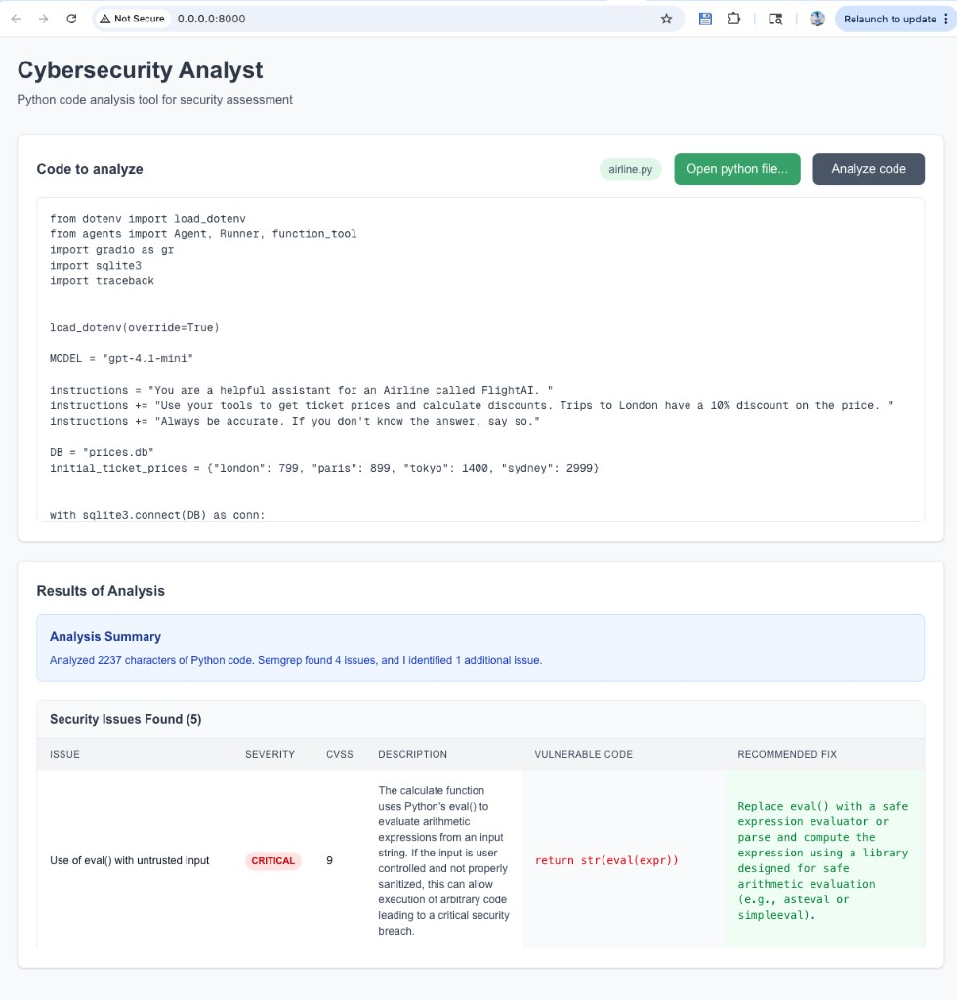
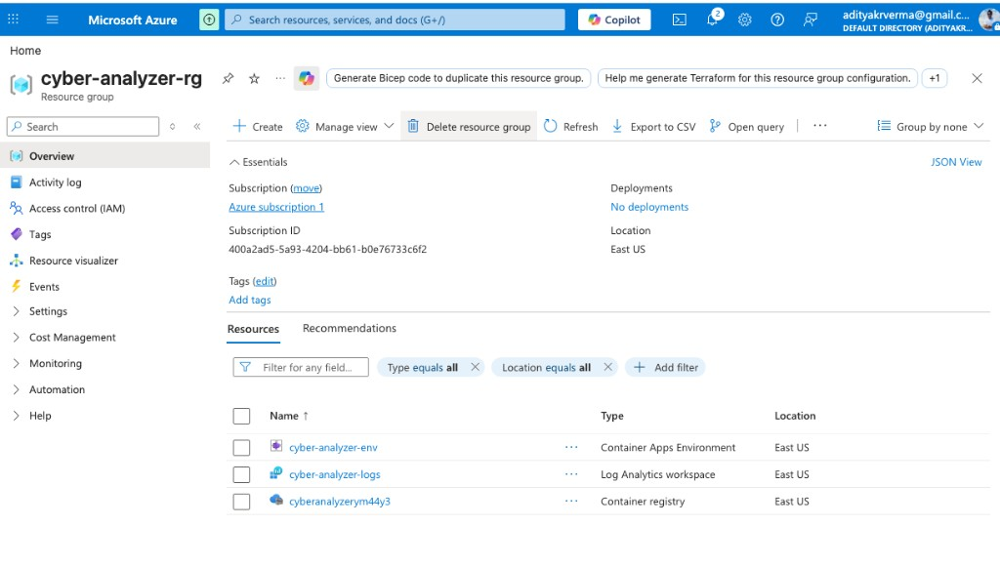

# Demo: Cybersecurity Analyzer

This page describes the **Cybersecurity Analyzer** demo (upload Python, run Semgrep plus model-assisted review) and how it maps to **Azure** when you deploy with the Terraform configuration under `terraform/azure/`.

Screenshots referenced below live in [`docs/assets/`](./assets/).

---

## What you are demoing

You open the analyzer in a browser, choose a Python file (for example [`airline.py`](../airline.py) from the repo root), and run **Analyze code**. The service:

1. **Ingests** the source you selected.
2. **Runs Semgrep** for static security rules (issues with rule IDs, paths, and severities).
3. **Uses an OpenAI model** (via the backend agent flow) to interpret results, add context, and flag additional risky patterns when appropriate.
4. **Returns** a structured summary: counts from Semgrep and the model, then a table-style report with severity, description, vulnerable lines, and suggested fixes.

The sample UI screenshot below was captured while the stack listened on **port 8000** (same port as the **Docker** workflow in the course: one container serves the API and the built frontend).



In the example above, the tool reports several findings for `airline.py`, including a **critical** issue around unsafe use of **`eval()`** on untrusted input, with remediation guidance (for example using a restricted expression evaluator instead of `eval`).

---

## Azure resources used (this project)

After **`terraform apply`** in `terraform/azure/` (see [`.week3/day1.part2.md`](../.week3/day1.part2.md)), Azure hosts the same container image you tested locally. Resources are created in the resource group you configure (default **`cyber-analyzer-rg`**) in your chosen region (for example **East US**).



### Resources shown in the portal screenshot

| Azure resource (example name) | Type | Role in the demo |
|------------------------------|------|------------------|
| **`cyber-analyzer-env`** | **Container Apps Environment** | Shared boundary for networking, logging integration, and running **Azure Container Apps** (the serverless container plane). |
| **`cyber-analyzer-logs`** | **Log Analytics workspace** | Collects logs and diagnostics from the Container Apps environment so you can troubleshoot and audit behavior (for example `az containerapp logs show` or Log Analytics queries). |
| **`cyber-analyzerm44y3`** (suffix varies) | **Azure Container Registry (ACR)** | Private registry where Terraform’s Docker build pushes the **`cyber-analyzer`** image; the Container App pulls from here. |

ACR names in this repo are **globally unique**; Terraform appends a random suffix to the base name derived from `project_name` (see `terraform/azure/main.tf`).

### Resource that always exists for the live URL but may not appear in a short portal list

| Resource | Type | Role |
|----------|------|------|
| **`cyber-analyzer`** (default `project_name`) | **Container App** | Runs your container: **FastAPI** backend, static **Next.js** UI, **OpenAI** calls, **Semgrep** MCP. Exposes the HTTPS URL from `terraform output app_url` (`*.azurecontainerapps.io`). |

If the Container App does not appear in the first **Resources** grid view, use search in the resource group or the subscription scope; it is a sibling resource of the environment and registry, not nested under them in the portal tree.

### End-to-end path on Azure

```text
Browser  --HTTPS-->  Azure Container App (cyber-analyzer)
                           |
                           +--> Pull image from ACR
                           +--> Env: OPENAI_API_KEY, SEMGREP_APP_TOKEN, ...
                           +--> Logs --> Log Analytics (cyber-analyzer-logs)
                           +--> Hosted in --> Container Apps Environment (cyber-analyzer-env)
```

There is **no** separate Azure OpenAI resource in this lab: the app calls **OpenAI’s API** using the key you pass in at deploy time. Semgrep uses your **Semgrep app token** the same way.

---

## Related documentation

- Deploy steps and cleanup: [`.week3/day1.part2.md`](../.week3/day1.part2.md)
- Architecture summary: [`docs/overview.md`](./overview.md)
